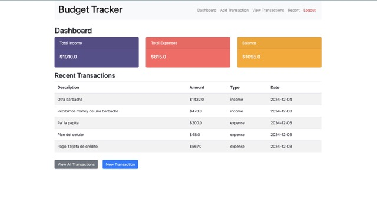
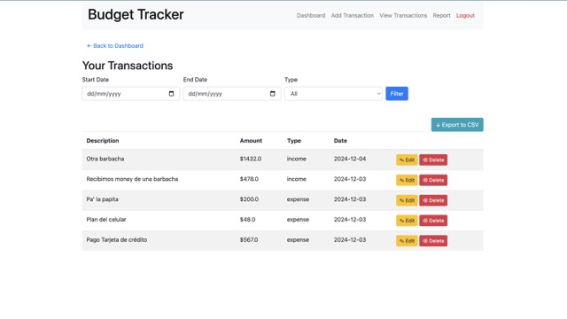
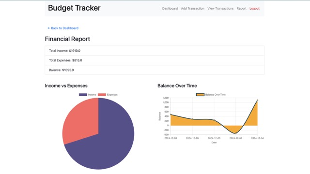

# BudgetTracker
A web-based Budget Tracker built with Python (Flask), SQLite, and Bootstrap. This app allows users to securely track income and expenses, generate financial reports, and manage transactions (add/remove) with a modern UI. Features include user authentication, transaction categorization, and balance summaries.

---

## Project Overview
The **Budget Tracker** is a Python-based web application designed to help users manage their income and expenses effectively. It allows secure user authentication, transaction management, and financial report generation.

## Features
- User Authentication (Register, Login, Logout)
- Add, Edit, and Delete Transactions
- View Transactions with Filtering by Date and Type
- Financial Reports:
  - Income vs. Expenses Pie Chart
  - Balance Over Time Line Chart
- Responsive design with Bootstrap

## Screenshots

Here are screenshots showcasing key features of the Budget Tracker application:

### Dashboard
The dashboard provides a quick overview of your financial data, including total income, total expenses, and a balance summary. It also displays recent transactions and navigation to other features.  


### Transactions
The transactions page displays all user transactions in a table format. Users can add, edit, delete, and filter transactions by date range or type.  


### Financial Report
The financial report visualizes data using a pie chart (Income vs. Expenses) and a line chart (Balance Over Time), providing insights into the user's financial performance.  


## Technologies Used
- **Python 3.9.6**
- **Flask** (Backend Web Framework)
- **Flask-SQLAlchemy** (ORM for SQLite)
- **Flask-WTF** (Form Handling)
- **SQLite** (Database)
- **Bootstrap** (Frontend Styling)

---

## Prerequisites

Before setting up the project, ensure you have the following installed:
- **Python**: Version 3.9 or later
- **pip**: Python's package manager
- **virtualenv**: For creating isolated Python environments

---

## Installation and Setup
1. **Clone the Repository**:
   ```bash
   git clone https://github.com/tibecvp/BudgetTracker.git
   cd BudgetTracker
   ```
2. **Set Up Virtual environment**:
    - Create the virtual environment:
    ```bash
    python -m venv venv
    ```
    - Activate the virtual environment
      - **Windows:** ```venv\Scripts\activate```
      - **macOS/Linux:** ```source venv\Scripts\activate```
3. **Install Dependencies**:  
    Install the required Python packages:
    ```bash
    pip install -r requirements.txt
    ````
4. **Set Up the Database**  
    **Initialize the Database**  
    To set up the database, open the Flask shell:
    ```bash
    flask shell
    ````  
    Run the following commands to create the tables:
    ```bash
    from app import db
    db.create_all()
    exit()
    ````

    This will create the necessary tables, including User and Transaction, in the SQLite database (budget_tracker.db).
5. **Run the Application**:
    - Start the Flask development server:
    ```bash
    python main.py
    ```
    - Open your browser and navigate to ```http://127.0.0.1:5000```

---

## Application Usage
1. **Register**  
  Navigate to http://127.0.0.1:5000/register to create a new user account.
2. **Login**  
  Log in at http://127.0.0.1:5000/login with your credentials.
3. **Dashboard**  
  After logging in, you’ll be redirected to the dashboard where you can:
    - View a financial summary
    - Add a transaction
    - View and manage all transactions
4. **Add a Transaction**  
  Go to http://127.0.0.1:5000/add_transaction to add income or expense transactions.
5. **View and Manage Transactions**  
  Visit http://127.0.0.1:5000/transactions to view, edit, delete, or filter transactions.
6. **View Reports**  
  Access the financial report at http://127.0.0.1:5000/report to:
    - View a pie chart of Income vs. Expenses.
    - View a line chart of Balance Over Time.

---

## File Structure
```graphql
BudgetTracker/
│
├── app/
│   ├── __init__.py                 # App and database initialization
│   ├── models.py                   # Database models
│   ├── routes.py                   # Application routes
│   ├── forms.py                    # WTForms for user input
│   ├── templates/                  # HTML templates
│   │   ├── base.html               # Base layout
│   │   ├── login.html              # Login page
│   │   ├── register.html           # Registration page
│   │   ├── transactions.html       # View transactions page
│   │   ├── add_transaction.html    # Add transaction page
│   │   ├── edit_transaction.html   # Edit transaction page
│   │   ├── report.html             # Financial report page
│   └── static/                     # Static files (CSS, JS, etc.)
│
├── main.py                         # Entry point for the app
├── requirements.txt                # Python dependencies
├── README.md                       # Documentation
└── venv/                           # Virtual environment
```

---

## Notes for Grading
- **Data Persistence**: Transactions and users are stored in an SQLite database.
- **Interactive Visuals**: The financial report includes a pie chart (Income vs. Expenses) and a line chart (Balance Over Time) built with Chart.js.
- **Responsive Design**: The app is styled with Bootstrap for responsiveness.

## Future Improvements
- Implement user-specific filtering by date range for reports.
- Deploy the application to a hosting service like Render or Vercel.
- Enhance security with password reset functionality.

## License
This project is licensed under the MIT license.
